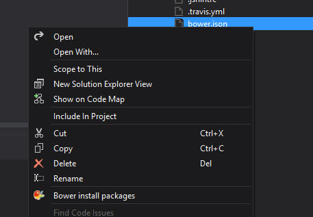
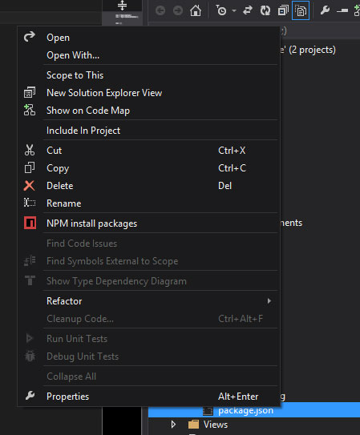
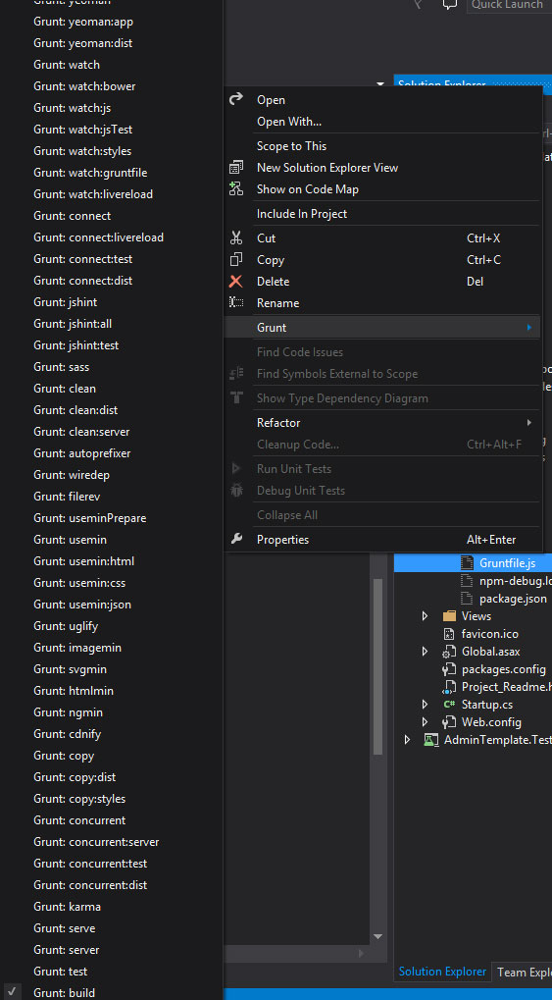

# Integração Visual Studio 2013 + NodeJs + Bower + Grunt + SASS  #

Seguindo os passos abaixo você poderá automatizar processos utilizados em ambiente de desenvolvimento front end de dentro do Visual Studio 2013.

## Instalação do NodeJs ##
Acesse o site do [NodeJs](http://nodejs.org/ "NodeJs") e instale a útima versão.

## Instanciando NodeJs e Bower na aplicação ##
Acesse o diretório base dos arquivos do projeto front end e execute os seguintes comandos:

`npm install`

`bower install` 

## Instalação do Grunt Launcher ##
Instale a extensão para Visual Studio 2013 do [Grunt Launcher](https://visualstudiogallery.msdn.microsoft.com/dcbc5325-79ef-4b72-960e-0a51ee33a0ff "Grunt Laucher").

Esta extensão permitirá executar comandos do Grunt de dentro do Visual Studio 

## Instalação do Intellisense para NPM e Bower (Opcional) ##
Instale a extensão do Visual Studio 2013 para [Intellisense NPM e Bower](https://visualstudiogallery.msdn.microsoft.com/65748cdb-4087-497e-a394-2e3449c8e61e "Intellisense NPM e Bower").

## Instalação do Ruby (apenas se houver uso do SASS) ##
- Baixe e instale o core do [Ruby](http://rubyinstaller.org/downloads/ "Ruby");
- Adicione o diretório bin nas variáveis de ambiente do windows e lembre-se de reiniciar o promp ao concluir. Para facilitar as configurações, dê preferência na utilização do driver de instalação do Windows;
- Faça download do [certificado](http://curl.haxx.se/ca/cacert.pem "certificado") e o adicione na pasta de instalação do Ruby. Este certificado resolverá o problema de conexão com o repositório de gemas;
- Adicione a seguinte chave nas variáveis de ambiente: `SSL_CERT_FILE:<% Caminho do certificado da etapa acima, incluir o nome cacert.pem %>`
- Reinicie o caso ele esteja aberto e execute o seguinte comando: `gem install sass`.

## Habilitando SASS no projeto (apenas se houver uso do SASS) ##
Acesso o diretório do projeto e execute o seguinte comando:

`npm install grunt-contrib-sass --save-dev`

## Utilizando Bower de dentro do Visual Studio ##
Para executar o Bower, basta clicar com o botão direito sobre o arquivo **bower.js** que no menu de contexto será exibido a opção **Bower install packages**.

## NPM de dentro do Visual Studio ##
Para executar o NPM, basta clicar o botão direito sobre o arquivo **packages.js** que no menu de contexto será exibido a opção **NPM install packages**.

## Grunt de dentro do Visual Studio ##
Para executar rotinas Grunt, basta clicar o botão direito sobre o arquivo **gruntfile.js** que no menu de contexto será exibido um submenu com o nome **Grunt** e nele conterá todas as rotinas possíveis para execução.

Durante a execução uma rotina, a mesma ficará marcada até que o processo seja finalizado.

Para atualizar todos os pacotes, basta clicar com o botão direito sobre o diretório **bower_components** que no menu de contexto será exibido a opção **Bower: Update all packages**.

Para atualizar um pacote especícico, basta clicar com o botão direito sobre o diretório **bower_components/paco_desejavel** que no menu de contexto será exibido a opção **Bower: Update pacote_desejavel**.
